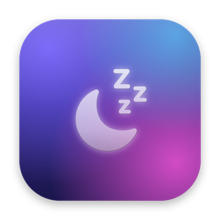
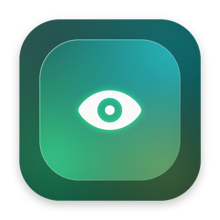
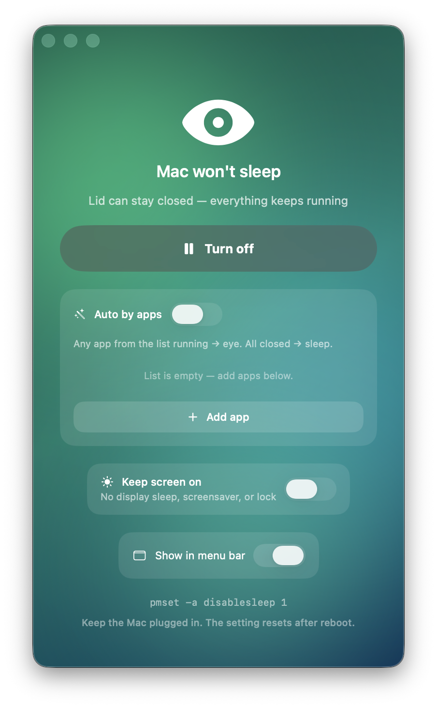

<div align="center">

&nbsp;&nbsp;&nbsp;

# DontSleep

**Keep your Mac awake with the lid closed — so the work keeps running.**

A tiny native macOS app in the **Liquid Glass** style. One button flips the system
sleep lock; an optional **auto mode** watches the apps you choose and turns it on/off
for you.




</div>

## Why

`caffeinate` (and most "stay awake" tweaks) **don't** keep a Mac running once the lid is
closed — clamshell mode sleeps anyway. The reliable lever is:

```bash
sudo pmset -a disablesleep 1   # stays awake even with the lid shut
sudo pmset -a disablesleep 0   # back to normal
```

DontSleep is a one-button front end for exactly that, plus automation so you never think
about it.

## Features

- 🔘 **One glass button** — toggle the sleep lock on/off.
- 🤖 **Auto mode by apps** — pick apps (e.g. `Claude.app`). While **any** of them is
  running, the Mac stays awake (eye). When they're **all** closed, normal sleep returns.
- 🔑 **Password once** — the first change sets up a passwordless rule scoped to *only*
  `pmset disablesleep`; after that everything (incl. automation) runs silently.
- ☀️ **Keep screen on** — an optional switch that also blocks display sleep, the
  screensaver, and the idle lock (via IOKit power assertions — no sudo, auto-reverts).
- 🧊 **State-aware icon** — calm indigo moon when off, green eye when awake; the Dock
  icon changes live too.
- 🌙 **Menu-bar item** — moon/eye glyph with a quick panel; toggle its visibility.
- 🌍 **Localized** — English and Russian (follows the system language).
- ✖️ **Close ≠ quit** — closing the window keeps the app alive in the menu bar / Dock.

## Install

**Download** the latest [release](https://github.com/theNcore1337/DontSleep/releases),
unzip, drag `DontSleep.app` to **Applications**. First launch: right-click → **Open**
(unsigned by an identified developer — that's expected for a self-built app).

Requirements: **Apple Silicon, macOS 26+**.

## Build from source

No Xcode project needed — `swiftc` compiles the single source file and the script
assembles the bundle:

```bash
git clone https://github.com/theNcore1337/DontSleep.git
cd DontSleep
bash build.sh
open DontSleep.app
```

## How it works

- **State** is read from `pmset -g` (no privileges needed).
- **Changing** it needs root. The first toggle shows the standard macOS auth prompt and
  installs `/etc/sudoers.d/dontsleep`:

  ```
  <you> ALL=(root) NOPASSWD: /usr/bin/pmset -a disablesleep 0, /usr/bin/pmset -a disablesleep 1
  ```

  The rule is validated with `visudo` and limited to that one command — nothing else runs
  passwordless. Remove it any time:

  ```bash
  sudo rm /etc/sudoers.d/dontsleep
  ```

- **Auto mode** polls `NSWorkspace` running apps every 3 s and applies the rule:
  any watched app running → `disablesleep 1`, all closed → `disablesleep 0`.
- **Keep screen on** holds an IOKit `PreventUserIdleDisplaySleep` assertion and
  periodically declares user activity, blocking display sleep, the screensaver, and the
  idle lock — no system settings changed, released the moment you turn it off.

> 💡 Keep the Mac on charger when working with the lid closed — airflow is restricted and
> `disablesleep` is a system-wide setting (it resets on reboot).

## Project layout

| File | Purpose |
|------|---------|
| `main.swift` | The whole app (SwiftUI + Liquid Glass + sleep control + auto mode). |
| `IconGenerator.swift` | Draws the glass app icons from code. |
| `build.sh` | Compiles + bundles `DontSleep.app`. |
| `en.lproj` / `ru.lproj` | Localizations. |

## License

[MIT](LICENSE) © theNcore
